# Euterpe: The Muse
Jonathan Lafiandra, Pranshu Gupta, Shrija Mishra, Shubhangi Upasani, Yuli Liu

CS7641: Machine Learning

### Motivation and Objective 

In the world today, there is more music than ever before. This abundance of musical data provides opportunities for us to take advantage of it. One of the facets of the music industry right now is that redundant lyrics sell extremely well. We wanted to take advantage of this formulaic industry and automate the process of generating lyrics in order to make the music industry more efficient and versatile. Our objective with this project is to analyze the ocean of music out there and find patterns that can be used to create new lyrics. Through this project, we aim to generate new lyrics specific to ten different genres and throw some light on several related aspects like their popularity prediction, clustering and genre classification.  

### Dataset preparation 

## The Million Song Dataset
The [Million Song Dataset](http://millionsongdataset.com/) is a dataset curated by an organization named EchoNest (now Spotify) that has one million songs where each song consists of 41 distinct features related to audio analysis (tempo, duration, mode, loudness etc), artist information (artist popularity, artist familiarity etc) and metadata (releases, title, song hotness etc). We look at the MSD summary data set for our project as the full MSD dataset is 280GB in size and difficult to work with. The summary dataset also has all the songs but it has only those features which are suitable to save in a key value format.  

## MetroLyrics Dataset
The [Metrolyrics Dataset](https://www.kaggle.com/gyani95/380000-lyrics-from-metrolyrics) dataset contains 362,237 songs from 18,231 artists with six columns for each song: song index, title, year released, artist, genre, and lyrics. All songs in the database were released between 1968 and 2016, excluding several songs incorrectly labeled with invalid years.

# Issues with Data Collection 
- The Mterolyrics dataset is built by scraping lyrics which is based on user input. And we all know "To err is human!"
- Songs are in various languages in Metrolyrics. Enserio??
- The dataset was heavily skewed towards Rock (131,377 songs; 36.27%). Other have around 1–2% of the sample with close to 6,000.

### Cleaning up the Metrolyrics dataset.
First, we need to clean up the dataset. 

- Shape before any cleaning (362237,3),
- Shape after drop duplicates  (250473, 3),
- We used a language detection library called cld-2. 
- Shape after removing non-English language songs (155954, 3), a huge loss in data equal to nearly half of the dataset.

- Songs leftover by genre:

### Forming the Final Dataset
The final dataset was made by merging the above two datasets. We could get 49,658 songs after the merge. Common songs in the same language were picked from both datasets and their fields were merged to include lyrics and genre information of the songs apart from the features already present in the MSD dataset.  

### Cleaning up the Metrolyrics dataset.
- We started with cleaning up the dataset, starting with 362237 tracks, after filtering out the duplicates, it came down to 250473
- We also removed the non-english lyrics, in order detect the language of the lyrics, we use a library named cld-2. The data size further came down to 155954 tracks.
- After all this cleanup we end up with neatly only half of the original dataset.

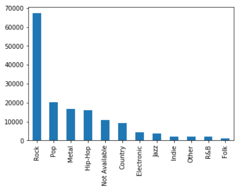

## Forming the Final Dataset
In the final dataset with take the tracks that are common in both MSD and the metrolyrics dataset. We have 49658 such songs. We convert the textual lyrics into vectors with "doc2vec" which creates a numeric representation of document, irrespective of the length of the document itself. 

### Data Analysis and Visualization
To begin with, we looked at how the different attributes in the dataset are distributed. The aim was to identify if there are any missing values in any column and whether there is any correlation between the attributes or not. 

The following figure shows the presence/absence of values for each attribute of the songs. We can see that the attributes like "artist_latitute", "artist_longitude" and "song_hottness" are sparsely populated.

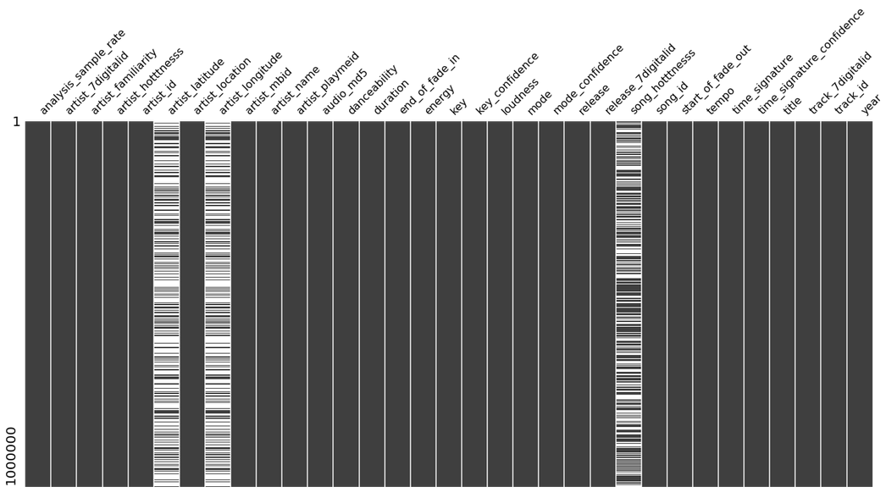

The following image shows distribution plots for the attributes - "artist_familiarity", "artist_hotttnesss", "song_hotttness", "duration", "key", "tempo", "loudness", "mode" and time_signature". 

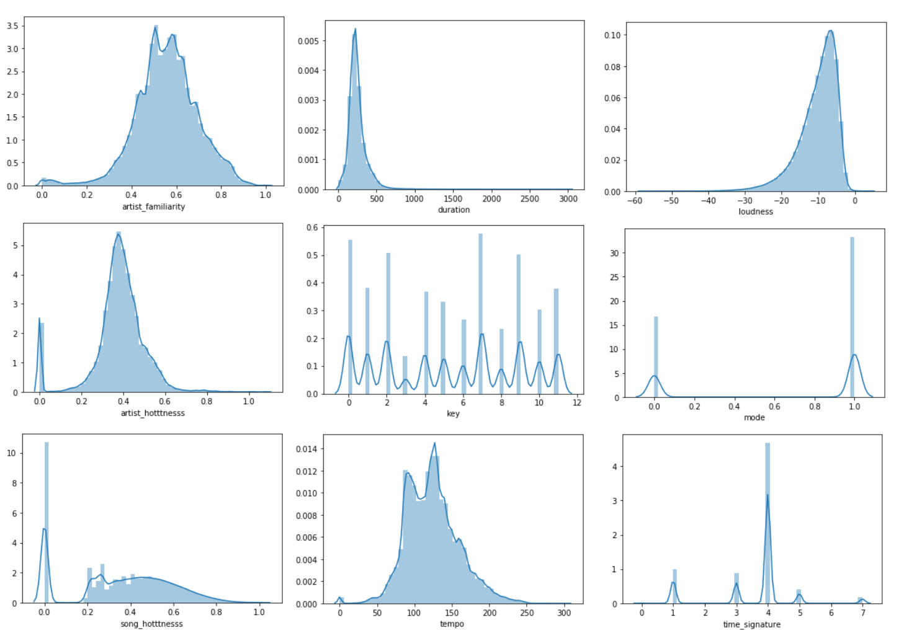

We also analyzed the songs based on their genres using k-means clustering. The song lyrics were used for making clusters. The results below show clusters of songs obained. 

### Preprocessig the Data
- to obtain a better results with Doc2Vec all the \n was replace with space and everything within [] and () was removed. 
    - example: [Chorus] and (x3)

## Clustering 

### Extracting Features
- We use Doc2Vec on Metrolyrics dataset inorder to gain insights into the lyrics. The reason why we choose Doc2Vec instead of Bag of Words is because a Bag of Words only gives information regarding individual words and their frequencies, but lacks the semantic grammar that is associated witth real speech. Doc2Vec is a NN that converts each document to a vector of a specific size of our choice which in this case is a (300,1) vector. This heavily reduces both computation expensiveness and brings along the power of the underlying information of the semantics of each song rather than just the word information. 
- We trained Doc2Vec using 20 Epochs and each Epoch going 20 iterations and a learning rate of 0.025.  

insert graph of doc2vec at different parameters and why we chose 20 epochs.

### Dimensionality Reduction
- After performing PCA on our data we realize that the variance recovery is fairly evenly split across all of our components. This means that we cannot reduce our dimensionality any further. This makes sense as Doc2vec uses each feature to diseminate the information related to each document across the vector.
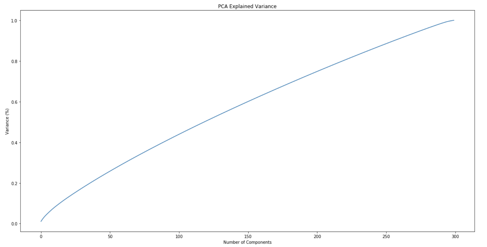

### Visualizing Data
-To visualize our data, first we did a 2-D graph based on the first two components in PCA, and a 3-D graph based on the first three components; however, as shown in the pictures here, the visualization was not great. This is because as found in Dim-Reduction, the share of variance across the components is fairly even. In order to correct this, we decided to use TNSE in order to obtain a 2-D representation of our data that incorporates all of the components.
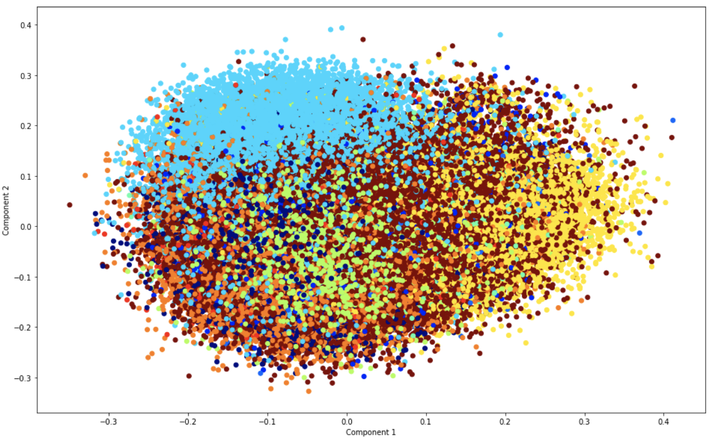
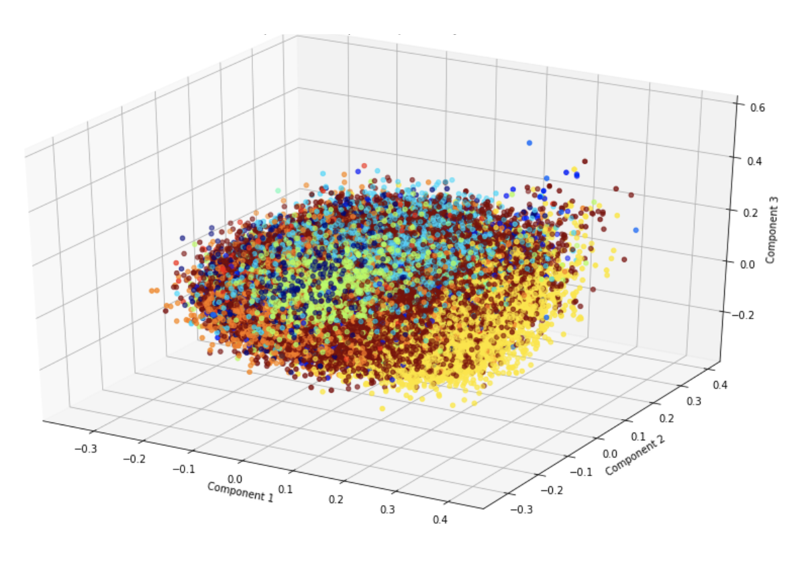
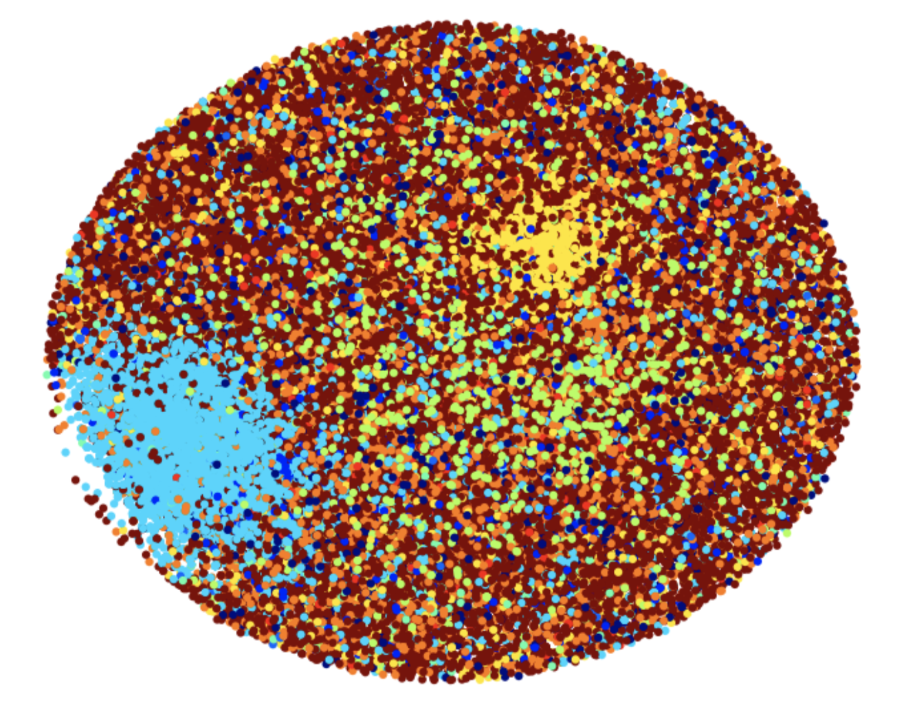

- still waiting for TNSE to finish
### Clustering Data
While clustering over our data, we used a couple different methods. We tried HDBscan, K-means, and Optic. Here are our results for each.

#### Kmean
With Kmeans, we tried to use the elbow method to find the best number of clusters, but it ended up being very bumpy. We decided to proceed with 20 clusters for best computation time and still a low sum_of_squared_distances.
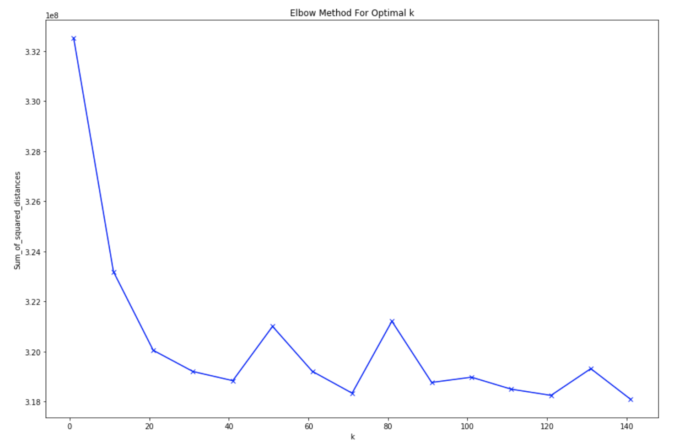

We found that suprisingly even with the variance qualities mentioned previously, the graph is still clearly differentiable using just 2 or 3 of the top PCA components.

Results after clustering based on top 2 PCA components
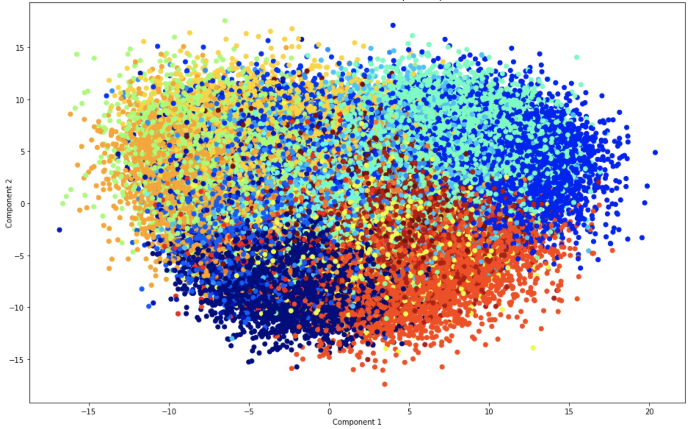
Results after clustering based on top 3 components
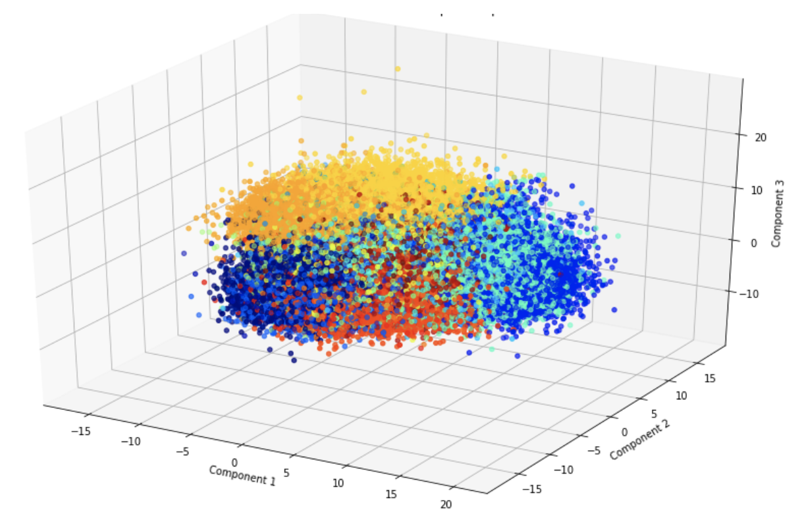

It's improved even futher by TNSE....

- still waiting for TNSE to finish
- need to do more analysis on data within the same cluster

##### Inte-Cluster Analysis

#### Optics

#### HDBSCAN 

## Song Popularity Prediction
As we can see from the above plots, "song_hotttnesss" - a metric of song popularity is an important feature which is not present in many of the records. In order to enrich our data with this feature, we first centered our dataset and then moved on to feature engineering. After this, we built several regression models to predict this feature by training it on the songs which had this attribute available. We compared these models based on their performances and chose the best-performing one. 

We were also curious to study the affect of lyrics on "song_hotttnesss". Therefore, we also trained the same models we used above on features extracted from both MSD and Metrolyrics data. The lyrics were converted into vectors using Doc2Vec module which converts paragraphs or documents to vectors (just like Word2Vec). The vectors obtained were high-dimensional which were then transformed using PCA reduction. These lyrics features were concatenated with MSD features to make the complete feature set and the regression models were trained on that. We observed that the models gave higher values of RMSE when trained with lyrics than when trained without them. This is probably because many of the most common words repeat in more and less popular songs to a similar extent. Hence, we conclude that lyrics have no significant effect on popularity of songs.

We also saw if any other attribute have any significant correlation with "song_hotttness". The correlation matrix has been shown below:

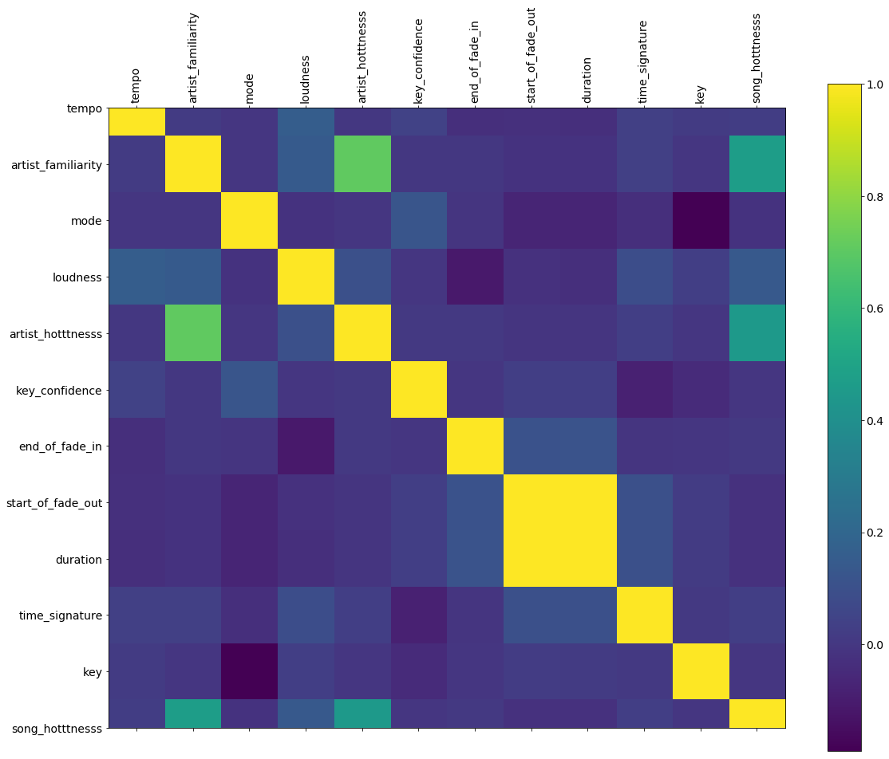

The RMSE and R2 scores for diffrent models are summarized as follows:

| Model | Train R2 Score | Test R2 Score | Test RMSE |
| ----- | -------------- | ------------- |  -------- |
| Bayesian Ridge Regression | 0.256777 | 0.256595 | 0.138673 |
| Linear Regression | 0.256777 |0.256607 | 0.138672 |
| Ridge Regression CV | 0.256777 | 0.256603 | 0.138672 |
| Lasso Regression CV | 0.256777 | 0.256607 | 0.138672 |
| Fully Connected NN | 0.282177 | 0.279620 | 0.136508 |
| Decision Trees | 0.322854 | 0.300984 | 0.134490 |
| Gradient Boost | 0.446687 | 0.367784 | 0.127883 |

We see that Gradient Boosting gives the best performance (lowest RMSE). 

## Feature Importances for Song Popularity
In order to understand which features of the song affect the popularity the most, we plot the weights of the features for all the models mentioned baove. As we can see in the figure below, the most important features are "artist_familiarity", "artist_hotttnesss" and the "loudness" of the song. From this, we infer that the more famous an artist is, more the popularity of a track made by them. 

## Word Frequency results
We wanted to classify genre based on the lyrics, and one of our thoughts was to take the top 5000 words in songs and count the frequency of each one in a song, and use that as our features. Unforunately, the data didn't didn't seperate very well. Here is the data tied to the most important 3 components. With their ground truth labels applied as the colors.

## Genre Classification

The next step was to learn to classify the genres of the songs based on their lyrics. For this, we again converted the lyrics to vectors using Doc2Vec and reduced the dimensionality of the vectors obtained by PCA reduction. Several classifier models were trained on the lyrics features and then tested for their performance scores. The results have been summarized below:    

| Model | Train Score | Test Score |
| ----- | -------------- | ------------- |
| Logistic Regression Classifier | 0.256470 | 0.189191 |
| Gaussian Naive Bayes | 0.209521 | 0.207513 |
| Support Vector Classifier | 0.523292 | 0.292802 |
| Decision Tree Classifier | 1.0 | 0.293726 |
| K Nearest Neighbors Classifier | 0.549464 | 0.388346 |
| Quadratic Discriminant Analysis Classifier | 0.780418 | 0.418379 |
| Multi Layer Perceptron Classifier | 0.754683 | 0.462798 |
| Random Forest Classifier | 1.0 | 0.476794 |
| AdaBoost Classifier | 0.490194 | 0.479418 |

We could infer that lyrics have a positive impact on genre classification of songs. This is probably because songs of the same genre have similar kinds of lyrics. Hence, classification based on genres showed positive results. 

## Lyrics Generation: TextGenRNN

### Data Cleaning for Text Processing

In order to work with text data and its analysis, we need to first study the text and make it appropriate for our training and learning. For this we perform some basic data cleaning as follows:
- Since the data has been collected by scraping web, we want to first get rid of html tags that are not required for our analysis. For this we have used BeautifulSoup to get html free text.
- Then we need to remove some punctuation marks as we don't want to focus on learning them. Also there are some unnecessary punctuation marks in the data. So we went ahead and removed all punctuations present in String.punctuation library of python.
- Next we also got rid of some of the stop words like 'a','by','at','any'. We couldn't get rid of all stop words as some of them are quintessential for the lyrics like 'you', 'i'.

One sample transformed text is as shown below:
- Before: 
Go read a book He shaked then he shook "I need that crack, I need that crack" You're swingin' the pipe Do what you like Goin' "doom doom" Reflect on the room  
- After : 
Go read book He shaked then he shook I need that crack I need that crack
Youre swingin the pipe Do what you like Goin doom doom Reflect on the room  

In order to generate lyrics, we unleashed the power of Recurrent Neural Networks with motivation from Andrej Karpathy’s char-rnn architecture that performs character level text generation. Thus, a well trained neural network will do considerable learning and reproduce next text similar to the one learnt. 

Built on tensorflow and keras, we have used a Python package called  textgenrnn. This is a wrapper over the char neural network model and also enables a great deal of flexibility. We have used Google Colab to run our notebooks. The environment is a 2 vCPUs, 13GB memory and a K80 GPU.  With rnn size of 256 units and 5 layers, we have trained our network for 50 epochs. The package provides us with the weights of a pretrained model on hundreds of text documents acquired from Reddit. The pre-trained model is useful since it has already gained knowledge and has embeddings that include the modern internet grammar. The model has a great influence on the language we are learning and helps in the generation of subsequent lyrics since it has already learnt from the diverse Reddit data. 

To incorporate the understanding for our lyrics, we have used this pretrained model and retrained all the layers on 1000 songs from each genre, i.e. 10000 songs altogether. This enabled our model to learn relations and context not present in the original dataset. This way we have transferred the learning from one dataset (Reddit data) to another (songs dataset) and have combined them to get some novel results. With this idea of transfer learning which enables us to improve our text comprehension by using pretrained networks, we thought of embedding learnings of genre-specific lyrics into our model. For this we separated our genre specific lyrics and used it to train our model on the previously trained model of 10000 lyrics. We then went ahead and generated lyrics based on a random seed provided. Seed is nothing but a prefix to start with. And whoa! here are the results:

### Performance Evaluation 

For evaluating our generated lyrics, we thought of testing it in two domains.
- Evaluate the candidate text using the Bleu Score. This will tell us how comprehensive our lyrics are. The Bilingual Evaluation Understudy Score, or BLEU for short, is a metric for evaluating a generated sentence to a reference sentence. This is achieved by counting matching n-grams in original lyrics and our newly generated lyrics obtained from a seed of the original song. Below are some of the results on comparing with the refernce songs.

| Reference Text | Generated Text | Unigram Bleu | Bigram Bleu | Trigram Bleu | Genre |
| -------------- | -------------- | ------------ | ----------- | ------------ | ----- |
| We see life through the same lens That's what you said to me And I knew that it was true Until you threw my heart in the sea How do I adjust my vision How do I pretend not to feel How do I act like we never met..........|That's what you said to me  And I knew that it was true But I'm just swaying  I've seen the Bar locking the bedroom floor  Remember the one up on summertime  Cause you rarely have a given three and then my dish  Your tipster call, I switch bad 'round this beat back people.......| 0.35 | 0.17 | 0.15 | Rock |
| I've been searching for reason and I'm running out of time I can feel that it's the season Time to make up my mind And I can't really tell ya what I'm gonna do There are so many thoughts in my head There are two roads to walk down And one road to choose So I'm thinking over the things that you've said I'm thinking over the things Thinking over, thinking over Thinking over the things that you've said| I'm running out of time I can feel that it's the season Time to make up my mind And I can't really tell ya what I'm gonna do There are so many thoughts in my head There are two roads to walk down And one road to choose Cause there's no stoppin' us To come it right there for you Fire insteads we woke up red to take it.. I've dreamed be a bang falls green Summer makes me flower Until I first stay. | 0.44 | 0.30 | 0.28 | Pop |

- In order to evaluate whether our generated lyrics is in sync with its sibling lyrics from the same genre, we take the generated lyrics and convert it to doc2vec. We then use our classification model and check the genre in which our lyrics is falling into. Below are the results summarised.

| Song | Actual Genre | Predicted Genre |
| ---- | ------------ | --------------- |
| Happiness Begins | Pop | Pop |
| Bohemian Raphsody | Country | Metal |
| Some rock song | Rock | Rock |

It is true that the top genre predicted is always not the correct one. In order to extend our study and observe our lyrics performance, we observed the top 20 predicted genres using KNN and found that the results do get better. It might also be the reason that the dataset is skewed. We have more rock songs so the predicted result is alogned to that.

### References 
- http://karpathy.github.io/2015/05/21/rnn-effectiveness/
- https://github.com/minimaxir/textgenrnn
- https://machinelearningmastery.com/calculate-bleu-score-for-text-python/

